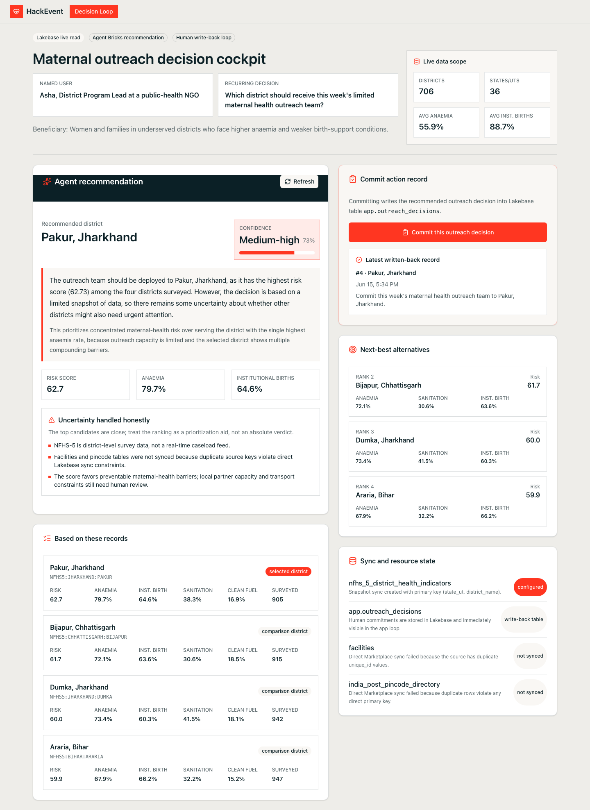

# Grounded

Grounded is a decision-support app for maternal-health outreach teams.

It helps a public-health NGO decide which Indian district should receive a limited outreach team each week. Instead of asking a program lead to browse spreadsheets or trust a black-box answer, Grounded gives one clear recommendation, shows the records behind it, explains uncertainty, and lets the user commit the final decision into an auditable Lakebase table.

## Live App

[Open the deployed Databricks App](https://hackevent-7474660379062721.aws.databricksapps.com)

Databricks Apps require authentication. The app is shared with the workspace `users` group.



## The Scenario

**User:** Asha, District Program Lead at a public-health NGO.

**Weekly decision:** Which district should receive this week's single maternal-health outreach team?

**Beneficiary:** Women and families in underserved districts, especially where anaemia is high and birth-support conditions are weaker.

The important thing: this is not a lookup. Several districts can look urgent for different reasons. Grounded is designed for that kind of judgment call.

## What the App Does

1. Reads NFHS-5 district health indicators from Lakebase Postgres.
2. Scores all 706 districts with a transparent maternal-health risk formula.
3. Uses Databricks Model Serving to synthesize a concise recommendation from the top Lakebase evidence rows.
4. Shows a confidence score and the reasons confidence is not absolute.
5. Shows a "Based on these records" list with source row IDs and metrics.
6. Lets Asha commit the recommendation.
7. Writes the committed action, citations, confidence, and uncertainty back to Lakebase.

The result is a closed loop:

```text
Live data -> cited recommendation -> human decision -> Lakebase write-back
```

## Why It Is Grounded

Every recommendation includes:

- Source record IDs, such as `NFHS5:JHARKHAND:PAKUR`
- The exact metrics used for ranking
- A confidence label and score
- Plain-language uncertainty factors
- A persisted decision record after commit

The model is not allowed to invent evidence. The backend first ranks districts deterministically from Lakebase data, then passes only the top cited records to Model Serving for recommendation wording.

## Example Recommendation

At build time, the top recommendation was:

**Pakur, Jharkhand**

Why:

- Anaemia among women 15-49: `79.7%`
- Institutional births: `64.6%`
- Improved sanitation: `38.3%`
- Clean fuel access: `16.9%`
- Women literacy: `46.7%`
- Maternal-health risk score: `62.73`

Closest comparison districts included Bijapur, Dumka, and Araria.

## Data

Grounded uses the DAIS 2026 hackathon Marketplace dataset.

Main synced Lakebase table:

```text
public.nfhs_5_district_health_indicators
```

Write-back table:

```text
app.outreach_decisions
```

More details are in [DATA_DICTIONARY.md](DATA_DICTIONARY.md).

## Honest Limitations

Grounded is intentionally upfront about what it does not know.

- NFHS-5 is survey-level data, not a real-time caseload feed.
- Some broader NFHS columns contain suppression markers such as `*` or parenthesized estimates.
- Facility and pincode tables were not used in the app loop because their source keys were not reliable enough for safe direct sync.
- Local logistics, partner capacity, and transport constraints still need human review.

That is why the app shows medium-high confidence instead of pretending the answer is certain.

## Technical Stack

- Databricks Apps
- AppKit
- React
- TypeScript
- Tailwind CSS
- Lakebase Postgres
- Unity Catalog synced table
- Databricks Model Serving endpoint: `databricks-gpt-oss-20b`

## Local Development

Install dependencies:

```bash
npm install
```

Run the app:

```bash
npm run dev
```

The local app runs at:

```text
http://localhost:8000
```

You need a configured Databricks CLI profile and Lakebase environment variables. See `.env.example` for the expected shape.

## Validation

```bash
npm run typecheck
npm run test:smoke
databricks apps validate --profile sandbox
```

## Deployment

```bash
databricks apps deploy -t default --profile sandbox
```

The deployed app declares:

- Lakebase Postgres access with `CAN_CONNECT_AND_CREATE`
- Model Serving access with `CAN_QUERY`
- `serving.serving-endpoints` user API scope

## Key Tradeoff

Grounded chooses reliability and honesty over surface area.

The dataset included facility and pincode tables, but those tables had duplicate-key issues that made direct Lakebase sync unsafe for a live operational demo. Rather than build on shaky joins, the app uses the clean district-level NFHS-5 table and exposes missing facility/logistics context as uncertainty.

## License

MIT. See [LICENSE](LICENSE).
